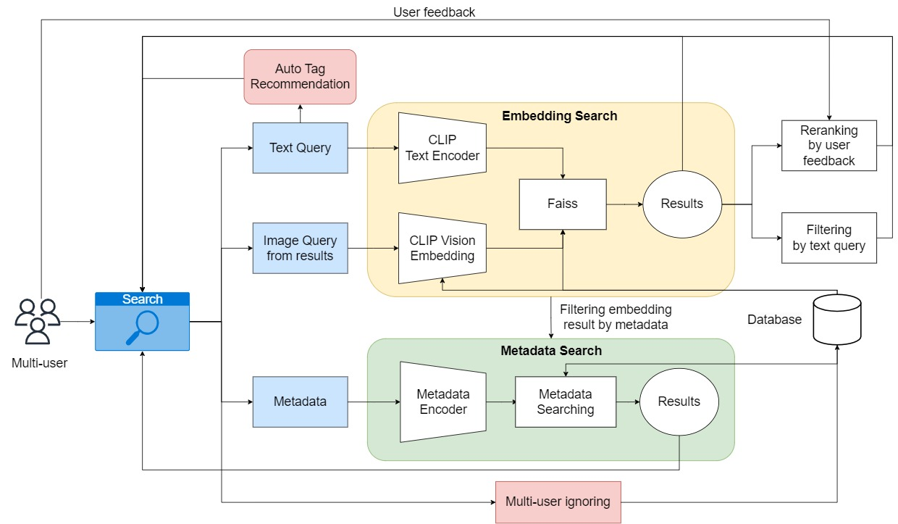
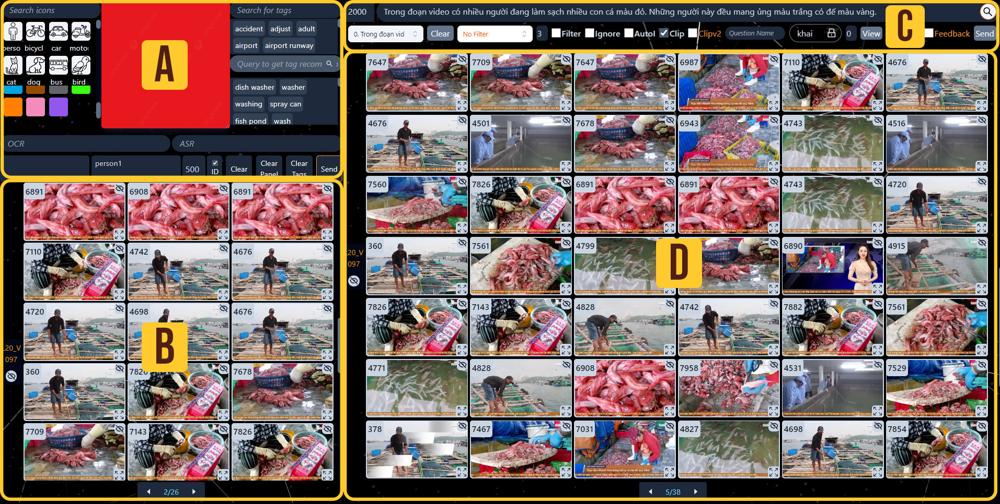

# Multi-User Video Search: Bridging the Gap Between Text and Embedding Queries
[Khai Trinh Xuan](https://github.com/trinhxuankhai), [Nguyen Nguyen Khoi](https://github.com/nguyen-brat), [Huy Luong-Quang](https://github.com/WMumei), [Sang Hoa-Xuan](https://github.com/HXSang), [Anh Nguyen-Luong-Nam](https://github.com/namanh2k2av), [Minh-Hung An](https://github.com/anminhhung)

**SOICT 2023** [[`Paper`](https://dl.acm.org/doi/10.1145/3628797.3628957)]

## Pipeline


## Dataset preparation
Dataset structure:
```
|- dict 
   |- ...
   |- faiss_clip_cosine.bin
   |- faiss_clipv2_cosine.bin
|- frontend
   |- ai
   |   |- public
   |   |   |- data
   |   |   |   |- KeyFrames
   |   |   |   |   |-L01
   |   |   |   |   |-L01_extra
   |   |   |   |   |-....
```

### Dict
Download dict zip file: [dict](https://drive.google.com/file/d/1pjArVhbXljkpCLpFGg71rh2yzwXGeJWi/view?usp=sharing)

### Vector embeddings
Download bin file: 
   - [faiss_clip_cosine.bin](https://drive.google.com/file/d/1_3Z-iR5b3cT-QAfY6u1oUf9__YNju4m1/view?usp=sharing)
   - [faiss_clipv2_cosine.bin](https://drive.google.com/file/d/1CZDLrRlOK7jmvTc-p6jARR4BA6PSA61M/view?usp=sharing)

### Keyframes
Download keyframes zip file and extract to folder frontend/ai/public/data.\
Data part 1:
   - [AIC_KeyframesB1_Reduced](https://www.kaggle.com/datasets/khitrnhxun/aic-keyframesb1-reduced)
   - [AIC_KeyframesB1_Extra_Reduced](https://www.kaggle.com/datasets/khitrnhxun/aic-keyframesb1-extra-reduced)

Data part 2:
   - [AIC_KeyframesB2_Reduced](https://www.kaggle.com/datasets/khitrnhxun/aic-keyframesb2-reduced)
   - [AIC_KeyframesB2_Extra_Reduced](https://www.kaggle.com/datasets/khitrnhxun/aic-keyframesb2-extra-reduced)

Data part 3:
   - [AIC_KeyframesB3_Reduced](https://www.kaggle.com/datasets/khitrnhxun/aic-keyframesb3-reduced)
   - [AIC_KeyframesB2_Extra_Reduced_0](https://www.kaggle.com/code/khitrnhxun/aic-keyframesb3-extra-reduced-notebook-0)
   - [AIC_KeyframesB2_Extra_Reduced_1](https://www.kaggle.com/code/khitrnhxun/aic-keyframesb3-extra-reduced-notebook-1)
   - [AIC_KeyframesB2_Extra_Reduced_2](https://www.kaggle.com/code/khitrnhxun/aic-keyframesb3-extra-reduced-notebook-2)

## Raw video from AIChallenge 2023
Data part 1:
   - [AIC_VideoB1v1](https://www.kaggle.com/datasets/superheroinmordenday/c00-vidieo)
   - [AIC_VideoB1v2](https://www.kaggle.com/datasets/khitrnhxun/aic-videob1v2)

Data part 2:
   - [AIC_VideoB2](https://www.kaggle.com/datasets/superheroinmordenday/aic-vidieob1v2)

Data part 3:
   - [AIC_VideoB3v1](https://www.kaggle.com/datasets/khitrnhxun/aic-videob3-0)
   - [AIC_VideoB3v2](https://www.kaggle.com/datasets/superheroinmordenday/aic-b2-v3)
   - [AIC_VideoB3v3](https://www.kaggle.com/datasets/nguynlngnamanh/aic-videob3-2)

## Dataset extraction
Detailed on dataset extraction: [data](dataset_extraction/README.md)

## Installation
- ### Backend
```
conda create -n AIChallenge2023
conda activate AIChallenge2023
pip install git+https://github.com/openai/CLIP.git
pip install -r requirements.txt
```

- ### Frontend
Install nodejs: https://nodejs.org/en/download
```
npm install
```

- ### DB Sever
```
pip install flask
pip install flask-cors
pip install flask-socketio
pip install pyngrok==4.1.1
ngrok authtoken your_token # Add your ngrok authentication
```

## Usage
It is recommended to configure the environment using Anaconda. Linux support only.

- ### Backend
Using local machine, from root of repo:
```
python3 app.py
```
Using colaboratory, run appNotebook (App section) for starting the backend.

- ### Frontend
Change url in frontend/ai/src/helper/web_url.js. 
```
cd frontend/ai/
npm run dev
```

- ### DB Sever
Open 2 terminal and run:
```
python appStorage.py
```
```
ngrok http 5000
```

- ### Interface


## Citation
If you have any questions, please leave an issue or contact us: trinhxuankhai2310@gmail.com
```
@inproceedings{10.1145/3628797.3628957,
author = {Trinh Xuan, Khai and Nguyen Khoi, Nguyen and Luong-Quang, Huy and Hoa-Xuan, Sang and Nguyen-Luong-Nam, Anh and An, Minh-Hung and Nguyen, Hong-Phuc},
title = {Multi-User Video Search: Bridging the Gap Between Text and Embedding Queries},
year = {2023},
isbn = {9798400708916},
publisher = {Association for Computing Machinery},
address = {New York, NY, USA},
url = {https://doi.org/10.1145/3628797.3628957},
doi = {10.1145/3628797.3628957},
abstract = {Video search is a crucial task in the modern era, as the rapid growth of video platforms has led to an exponential increase in the number of videos on the internet. Effective video management is therefore essential. Significant research has been conducted on video search, with most approaches leveraging image-text retrieval or searching by object, speech, color, and text in images. However, these approaches can be inefficient when multiple users search for the same query simultaneously, as they may overlap in their search spaces. Additionally, most video search systems do not support complex queries that require information from multiple frames in a video. In this paper, we propose a solution to these problems by splitting the search space for different users and ignoring images that have already been considered by other users to avoid redundant searches. To address complex queries, we split the query and apply a technique called forward and backward search.},
booktitle = {Proceedings of the 12th International Symposium on Information and Communication Technology},
pages = {923–930},
numpages = {8},
keywords = {embedding-based search, interactive video retrieval, multi-user search engine, multimedia and multimodal retrieval, text-based search},
location = {Ho Chi Minh, Vietnam},
series = {SOICT '23}
}
```
